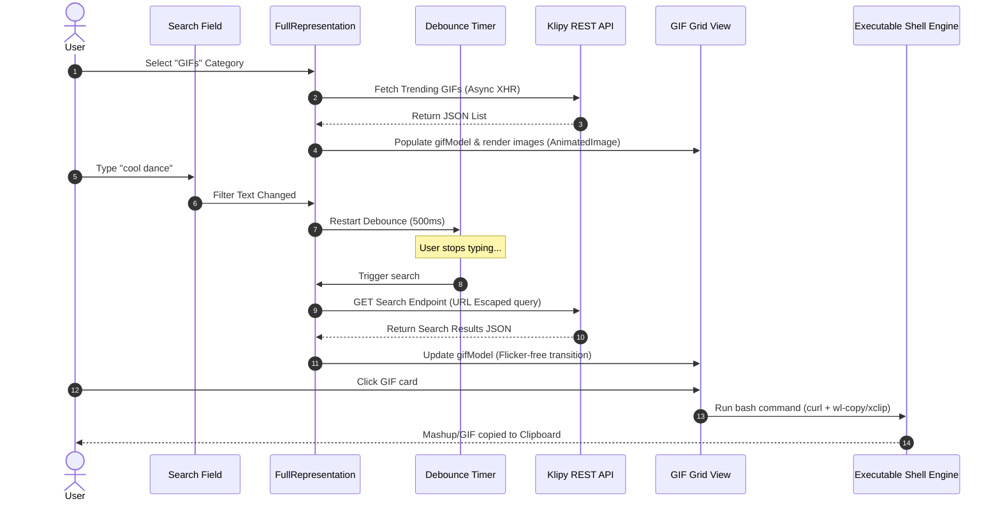

# 🎬 Klipy GIF Sidebar Category: Implementation Plan

This implementation plan provides a comprehensive guide for integrating a premium, animated GIF search category into the **kMoji** KDE Plasmoid using the **Klipy API**.

---

## 📐 Architectural Design & System Flow

Integrating dynamic media files like GIFs is fundamentally different from kMoji's local SQLite/JS database of static emojis. This category relies on real-time internet searches, dynamic paging, asynchronous image loading, and clipboard copy procedures that write raw media data.

The following sequence diagram outlines how the user interaction propagates through kMoji's architecture:



---

## 🛠️ Step-by-Step Implementation Guide

### Phase 1: General Settings & Configuration (`main.xml` & `ConfigGeneral.qml`)

We must allow users to manage their Klipy integration. This includes specifying their own **Klipy API Key** (so kMoji is robust to rate-limiting) and choosing their preferred **Clipboard Action** (e.g., copying the raw `.gif` file vs. the GIF's URL).

#### 1. Add Configuration Keys to `main.xml`
In [main.xml](file:///home/montas/kMoji/plasmoid/contents/config/main.xml), we declare three new settings keys within the General group:

```xml
<!-- Add in plasmoid/contents/config/main.xml under general group -->
<entry name="KlipyApiKey" type="String">
  <label>Klipy API Key</label>
  <default>c9d81d227b0b4b2fb4e0bd6f6e52003c</default> <!-- Free-tier default or empty -->
</entry>

<entry name="KlipyCopyAction" type="Enum">
  <label>GIF Clipboard Click Action</label>
  <choices>
    <choice name="CopyRawGif">Copy Raw GIF File</choice>
    <choice name="CopyGifUrl">Copy GIF URL Link</choice>
    <choice name="CopyBoth">Copy Both Link & File</choice>
  </choices>
  <default>CopyRawGif</default>
</entry>
```

#### 2. Build Configuration Form inside `ConfigGeneral.qml`
Add a beautiful, styled configuration card to [ConfigGeneral.qml](file:///home/montas/kMoji/plasmoid/contents/ui/config/ConfigGeneral.qml):

```qml
// Add in plasmoid/contents/ui/config/ConfigGeneral.qml
property alias cfg_KlipyApiKey: klipyApiKeyInput.text
property alias cfg_KlipyCopyAction: klipyCopyActionCombo.currentIndex

// Visual UI Section:
ConfigSection {
    text: i18n("Klipy GIF Integration")
}

Kirigami.FormLayout {
    Layout.fillWidth: true

    TextField {
        id: klipyApiKeyInput
        Kirigami.FormData.label: i18n("Klipy API Key:")
        placeholderText: i18n("Enter your Klipy API Key")
        passwordCharacter: "●"
        echoMode: TextInput.PasswordEchoOnEdit
        Layout.fillWidth: true
    }

    ComboBox {
        id: klipyCopyActionCombo
        Kirigami.FormData.label: i18n("Clipboard Click Action:")
        Layout.fillWidth: true
        model: [
            i18n("Copy Raw GIF (Recommended)"),
            i18n("Copy GIF Link URL"),
            i18n("Copy Both File & Link")
        ]
    }
}
```

---

### Phase 2: Category Integration & Sidebar Updates (`FullRepresentation.qml`)

We need to add a brand new category block, define state tracking, and ensure we handle filtering cleanly without crashing local index queries.

#### 1. Define Constant Categories
In [FullRepresentation.qml](file:///home/montas/kMoji/plasmoid/contents/ui/FullRepresentation.qml):

```qml
// Near line 96 in FullRepresentation.qml
readonly property string catGifs: "GIFs"

// Inside defaultCategoryOrder:
property var defaultCategoryOrder: [
    { name: catEmojiKitchen, displayName: i18n("Emoji Kitchen"), icon: "path-union-symbolic" },
    { name: catGifs,         displayName: i18n("GIFs (Klipy)"),   icon: "image-gif" }, // New Category!
    { name: catAll,          displayName: i18n("All"),            icon: "view-list-icons" },
    ...
]
```

#### 2. Update Grid Visibility & Layout
Inside `emojiArea` in `FullRepresentation.qml`, add a custom `gifView` component that sits side-by-side with `kitchenView` and the standard `emojiGridView`:

```qml
// Inside emojiArea Item
Item {
    id: gifView
    anchors.fill: parent
    visible: fullRoot.selectedCategory === fullRoot.catGifs

    // ListModel to store dynamic API results
    ListModel {
        id: gifModel
    }

    // Loader/Spinner when requesting API
    Kirigami.LoadingPlaceholder {
        anchors.centerIn: parent
        visible: gifSearchTimer.running || gifView.isLoading
        text: i18n("Loading awesome GIFs...")
    }

    // Grid View for GIFs
    GridView {
        id: gifGridView
        anchors.fill: parent
        cellWidth: Math.floor(gifView.width / 3) // Sleek 3-column masonry/grid
        cellHeight: 140
        model: gifModel
        visible: !gifSearchTimer.running && !gifView.isLoading && gifModel.count > 0
        clip: true

        delegate: Item {
            width: gifGridView.cellWidth
            height: gifGridView.cellHeight
            padding: 4

            Rectangle {
                anchors.fill: parent
                anchors.margins: 4
                color: Kirigami.Theme.alternateBackgroundColor
                radius: 8
                border.width: hoverHandler.hovered ? 2 : 1
                border.color: hoverHandler.hovered ? Kirigami.Theme.highlightColor : Qt.rgba(0,0,0,0.1)

                // Premium Micro-Animation: AnimatedImage only plays when hovered, otherwise displays static frame!
                AnimatedImage {
                    id: gifImg
                    source: model.previewUrl
                    anchors.fill: parent
                    anchors.margins: 2
                    fillMode: Image.PreserveAspectCrop
                    playing: hoverHandler.hovered // Play GIF only on mouse hover!
                    paused: !hoverHandler.hovered
                    
                    // Soft fade-in transition
                    opacity: status === AnimatedImage.Ready ? 1.0 : 0.0
                    Behavior on opacity { NumberAnimation { duration: 150 } }
                }

                // Show title on hover
                Rectangle {
                    anchors.bottom: parent.bottom
                    anchors.left: parent.left
                    anchors.right: parent.right
                    height: 24
                    color: Qt.rgba(0, 0, 0, 0.6)
                    radius: 8
                    visible: hoverHandler.hovered

                    Text {
                        text: model.title
                        color: "white"
                        font.pixelSize: 10
                        elide: Text.ElideRight
                        anchors.centerIn: parent
                        width: parent.width - 8
                    }
                }

                HoverHandler {
                    id: hoverHandler
                }

                MouseArea {
                    anchors.fill: parent
                    cursorShape: Qt.PointingHandCursor
                    onClicked: {
                        gifView.copyGif(model.rawUrl, model.title)
                    }
                }
            }
        }
    }
}
```

---

### Phase 3: Klipy Networking & Debounce Controller

We should avoid issuing network requests on every keystroke by implementing a debounce pattern. We will use `XMLHttpRequest` to interact with Klipy's REST endpoints asynchronously.

#### 1. Add Debounce Timer & State Properties
In `FullRepresentation.qml`:

```qml
property bool isGifLoading: false

Timer {
    id: gifSearchTimer
    interval: 500 // Debounce typing by half a second
    repeat: false
    running: false
    onTriggered: {
        gifView.fetchGifs(fullRoot.filter)
    }
}

// Hook into text updates
onFilterChanged: {
    if (fullRoot.selectedCategory === fullRoot.catGifs) {
        gifSearchTimer.restart()
    }
}
```

#### 2. Network Request Implementation
Add these API functions to `gifView` inside `FullRepresentation.qml`:

```javascript
function fetchGifs(query) {
    gifView.isLoading = true
    var apiKey = plasmoid.configuration.KlipyApiKey || "c9d81d227b0b4b2fb4e0bd6f6e52003c"
    var url = "https://api.klipy.com/api/v1/" + apiKey + "/gifs/search?query=" + encodeURIComponent(query) + "&per_page=24"

    if (!query || query.trim() === "") {
        url = "https://api.klipy.com/api/v1/" + apiKey + "/gifs/trending?per_page=24"
    }

    var xhr = new XMLHttpRequest()
    xhr.open("GET", url)
    xhr.onreadystatechange = function() {
        if (xhr.readyState === XMLHttpRequest.DONE) {
            gifView.isLoading = false
            if (xhr.status === 200) {
                var response = JSON.parse(xhr.responseText)
                if (response.result && response.data && response.data.data) {
                    gifModel.clear()
                    var list = response.data.data
                    for (var i = 0; i < list.length; i++) {
                        // Accessing nested files object containing GIF URLs
                        var item = list[i]
                        var rawGif = item.files && item.files.gif ? item.files.gif.url : ""
                        var previewGif = item.files && item.files.tiny_gif ? item.files.tiny_gif.url : rawGif

                        if (rawGif !== "") {
                            gifModel.append({
                                title: item.title || "Klipy GIF",
                                rawUrl: rawGif,
                                previewUrl: previewGif
                            })
                        }
                    }
                }
            } else {
                console.log("ERROR: Klipy API returned status: " + xhr.status)
            }
        }
    }
    xhr.send()
}
```

---

### Phase 4: Premium Copy-To-Clipboard Scripting

When the user clicks a GIF card, we copy either the file, URL, or both to their clipboard. We can leverage the existing `executable` engine connection in `FullRepresentation.qml`.

```javascript
function copyGif(gifUrl, title) {
    if (!gifUrl) return;

    var copyAction = plasmoid.configuration.KlipyCopyAction
    var cmd = ""
    var tmpFile = "/tmp/kmoji_" + Date.now() + ".gif"

    // 1. Setup shell script combinations
    var downloadCmd = 'curl -sL "' + gifUrl + '" > ' + tmpFile
    var wlCopyFile = 'wl-copy --type image/gif < ' + tmpFile
    var xclipFile = 'xclip -selection clipboard -t image/gif -i ' + tmpFile
    var wlCopyText = 'wl-copy "' + gifUrl + '"'
    var xclipText = 'echo -n "' + gifUrl + '" | xclip -selection clipboard'

    if (copyAction === 0) {
        // Copy File
        cmd = downloadCmd + ' && (' + wlCopyFile + ' || ' + xclipFile + ')'
    } else if (copyAction === 1) {
        // Copy URL Link
        cmd = wlCopyText + ' || ' + xclipText
    } else {
        // Copy Both (Writes link + file)
        cmd = downloadCmd + ' && (' + wlCopyFile + ' || ' + xclipFile + ') && (' + wlCopyText + ' || ' + xclipText + ')'
    }

    // 2. Connect to the shell source engine to run the command asynchronously
    shellSource.connectSource(cmd)
    
    // 3. Show a premium user feedback message!
    showPasteTemporaryMessage(i18n("Copied GIF to clipboard!"))
}
```

---

## 🎨 Premium UI & Styling Recommendations

To ensure this feels like a state-of-the-art native desktop integration rather than a basic webview, we recommend these premium details:

1. **Masonry/Grid Styling**: Use dynamic column sizing (`cellWidth`) based on the widget width. Set grid boundaries so cards stay crisp.
2. **Glassmorphism Overlay**: Give hovered cards a subtle white/highlight borders and drop shadows.
3. **Smart Cache System**: Add a local map cache so that if the user clicks between categories, previously fetched GIF grids are instantly shown without waiting for the network again.
4. **Infinite Scroll Pagination**: Connect `gifGridView.onContentYChanged` to a page fetcher to fetch the next page once the user scrolls to 90% of the content height.

---

> [!IMPORTANT]
> To execute this plan, the user's system must have either `wl-clipboard` (for Wayland sessions) or `xclip` (for X11 sessions) installed. We check both sequentially in the copy shell string.
